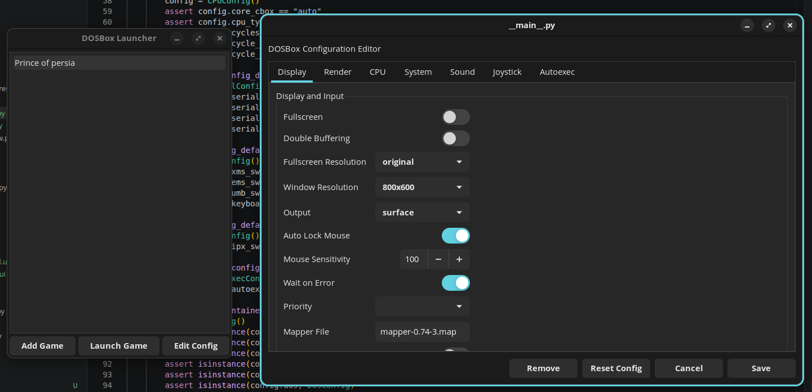

# DOSBox Launcher

A small GTK3 desktop app for managing DOS games and launching them with DOSBox.

## Screenshot



## Features

- Add games to a local library
- Launch a game with DOSBox
- Edit per-game DOSBox configuration
- Reset configs to defaults
- Browse common and advanced DOSBox settings from the UI

## Current Status

Personal project, Linux-focused, and intended primarily for source checkout usage.

This repository is set up to be easy to clone and run locally rather than being heavily packaged for distribution.

## Requirements

Linux desktop with:

- Python 3.10+
- DOSBox installed and available in `PATH`
- GTK 3
- PyGObject build/runtime dependencies

Typical Ubuntu/Debian packages:

```bash
sudo apt install python3 python3-venv python3-dev dosbox libgirepository1.0-dev libcairo2-dev pkg-config gir1.2-gtk-3.0
```

Typical Fedora packages:

```bash
sudo dnf install python3 python3-devel dosbox gobject-introspection-devel cairo-devel pkgconf-pkg-config gtk3
```

## Clone

```bash
git clone https://git.splaq.us/splaq/DOSBoxLauncher.git
cd DOSBoxLauncher
```

## Setup

Create and activate a virtual environment:

```bash
python3 -m venv .venv
source .venv/bin/activate
```

Install the app in editable mode:

```bash
pip install -e .
```

## Run

Run from the repository root:

```bash
dosboxlauncher
```

You can also run:

```bash
python -m dosboxlauncher
```

## Notes

- Run the app from the repository root for now.
- DOSBox must already be installed separately.
- App config and game metadata are stored in user config/data directories managed by `platformdirs`.
- Each game gets its own DOSBox config file.

## Known Limitations

- The app currently expects repository-relative UI/config assets, so installed usage outside the repository root is not the primary workflow yet.
- Linux is the primary target environment.
- DOSBox itself is not bundled.

## Troubleshooting

### `dosbox` not found

Install DOSBox and make sure it is available in `PATH`:

```bash
dosbox --version
```

### PyGObject install fails

Usually this means the GTK / gobject-introspection system packages are missing. Install the OS packages listed above, then retry:

```bash
pip install -e .
```

### UI files not found

Make sure you launched the app from the repository root:

```bash
cd DOSBoxLauncher
dosboxlauncher
```

## Development

Run tests:

```bash
pytest
```

Run lint:

```bash
ruff check src tests
```
